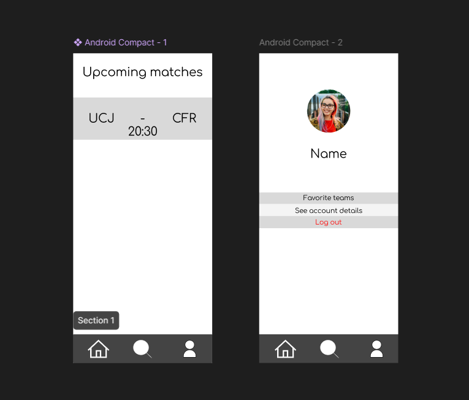

# Short Description

This is a mobile application that lets users keep track of football matches. After signing in, users can search for clubs, see details about them and add clubs to their favorites. Before games of their favorite clubs, users get notified about the lineups, while the app also sends out a notification after the game about the match stats.

# Domain details

## User

- Email: the users' email address
- Name: the users' name
- Password: the users' password
- List of favorite clubs: a list which keeps track of the users' favorite clubs

## Club

- Name: the name of the football club
- Manager: the manager of the team
- List of players: all the players who play for the club
- Year of foundation: the year the club was founded
- Home stadium: the stadium where the team plays their home games

## Player/Manager

- Name: the name of the player or manager
- Age: the age of the player or manager
- Nationality: the nationality of the player or manager

## Match

- Home team: the team playing at home
- Away team: the team playing away
- Home goals: goals scored by the home team
- Away goals: goals scored by the away team
- Home posession: the posession of the home team
- Away posession: the posession of the away team

# CRUD operations

- User: create new user, update user details, see user details, delete account, add a club to users' favorites

# Persistence details

- The clubs, players/managers and matches are persistent on the server and can only be created manually from the backend or fetched from the outside
- The users are also persistent on the server, and once a user gets created it perssist also on the local db
- The users' list of favorite clubs is persistent on the local db, and if you try to access a team, it fetches the details from the server

# Offline device details

- When users are offline they can still see their favorite clubs, but cannot access the club details
- Users can't search for teams when they are offline, or see upcoming matches
- A status bar appears to notify users when there is no connection

# App mockup

